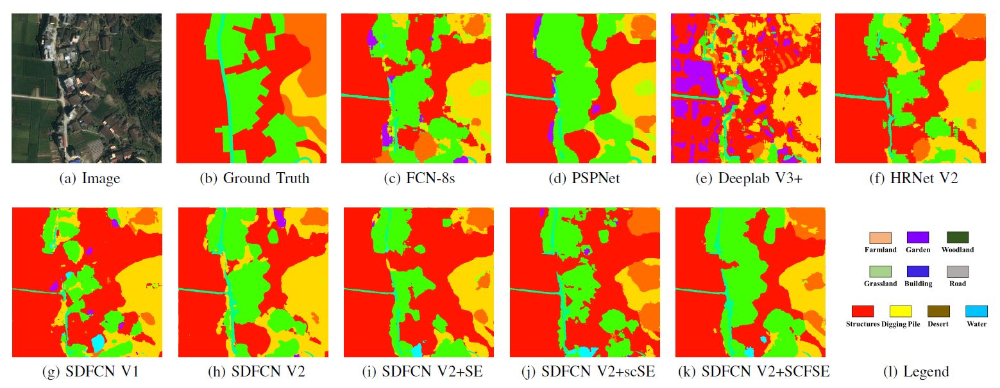

SDFCNv2: An Improved FCN Framework for Remote Sensing Images Semantic Segmentation
-----------

## Challenges

In our [previous work](http://ieeexplore.ieee.org/document/8326706/), we proposed a semantic segmentation framework on VHR RS images based on the SDFCNv1 (Symmetrical dense-shortcut deep fully convolutional networks) model and a post-processing method, attempting to eliminate ``salt and pepper'' phenomena and block effects in prediction results. However, there are still some drawbacks in SDFCNv1 framework and other common FCN-based frameworks as follow:

* **Limited model input size and receptive field (RF)**: A larger RF may increase the complexity and feature abstraction level of the FCN model, and enable the model to detect global structures/shapes over simple texture patterns.
* **Overfitting phenomenon**: Oversize model with large number of parameters cost more computational resources. When training on small-scale datasets with few categories such as the ISPRS 2D semantic labeling datasets, models are more prone to fall into over-fitting. Besides, other factors like seasonal changes, diverse image resolution and illumination conditions may also cause model's instability.
* **Simple post-processing methods for overlarge RS image segmentation**: Commonly-used methods simply merge predictions in a sliding-window majority-voting manner. Under different scales of overlapping stride, the final fusion result for the whole RS images differs accordingly. Excessive overlap degree will distinctly increase the amount of calculation.

## SDFCNv2

In this research, we propose an improved semantic segmentation framework named SDFCNv2 based on SDFCNv1, to conduct optimal semantic segmentation on RS images. We first construct a novel FCN model with hybrid basic convolutional (HBC) blocks and spatial-channel-fusion squeeze-and-excitation (SCFSE) modules, which occupies larger receptive field and fewer network model parameters. Moreover, we put forward a spectral-specific-stochastic-gamma-transform-based (SSSGT-based) data augmentation method in model training process to improve generalizability of our model. Besides, we design a mask-weighted voting decision fusion post-processing algorithm for image segmentation on overlarge RS. We conducted several experiments on two public datasets and a real surveying and mapping dataset. Extensive experimental results demonstrate that our SDFCNv2 framework
	can improve the mIoU metric by up to 5.22\% compared with the SDFCNv1 framework while using only about half the number of parameters. 

All codes of this paper are based on the [CVEO_FCN
](https://github.com/CVEO/CVEO_FCN) project.

## Experiments

we conducted experiments on two public datasets named [Potsdam dataset](https://www2.isprs.org/commissions/comm2/wg4/benchmark/semantic-labeling/), [Evlab dataset](http://earthvisionlab.whu.edu.cn/zm/SemanticSegmentation/index.html), and one realdata self-constructed dataset named Songxi dataset.

### Performances of different models on three experiment datasets

| Dataset |      Model     |   OA   |    K   |  mIoU  |
|:-------:|:--------------:|:------:|:------:|:------:|
| Potsdam | FCN-8s         | 0.7444 | 0.7021 | 0.5586 |
|         | PSPNet         | 0.8059 | 0.7687 | 0.6364 |
|         | Deeplab V3+    | 0.7436 | 0.6989 | 0.5263 |
|         | HRNet V2       | 0.8380 | 0.8029 | 0.6584 |
|         | SDFCN V1       | 0.8006 | 0.7615 | 0.6081 |
|         | SDFCN V2       | 0.8473 | 0.8140 | 0.6741 |
|         | SDFCN V2+SE    | 0.8419 | 0.8077 | 0.6744 |
|         | SDFCN V2+scSE  | 0.8262 | 0.7920 | 0.6685 |
|         | SDFCN V2+SCFSE | 0.8503 | 0.8177 | 0.6782 |
|  EvLab  | FCN-8s         | 0.4730 | 0.4313 | 0.2067 |
|         | PSPNet         | 0.4956 | 0.4647 | 0.2559 |
|         | Deeplab V3+    | 0.5492 | 0.5085 | 0.2733 |
|         | HRNet V2       | 0.5288 | 0.4831 | 0.2453 |
|         | SDFCN V1       | 0.5083 | 0.4641 | 0.2448 |
|         | SDFCN V2       | 0.5773 | 0.5380 | 0.2963 |
|         | SDFCN V2+SE    | 0.5631 | 0.5301 | 0.3017 |
|         | SDFCN V2+scSE  | 0.4883 | 0.4532 | 0.2496 |
|         | SDFCN V2+SCFSE | 0.5945 | 0.5539 | 0.3208 |
|  Singxi | FCN-8s         | 0.8567 | 0.7215 | 0.3456 |
|         | PSPNet         | 0.8602 | 0.7307 | 0.3833 |
|         | Deeplab V3+    | 0.7708 | 0.5758 | 0.2042 |
|         | HRNet V2       | 0.8584 | 0.7208 | 0.3448 |
|         | SDFCN V1       | 0.8627 | 0.7280 | 0.3440 |
|         | SDFCN V2       | 0.8461 | 0.6955 | 0.3458 |
|         | SDFCN V2+SE    | 0.8657 | 0.7340 | 0.3708 |
|         | SDFCN V2+scSE  | 0.8697 | 0.7471 | 0.3621 |
|         | SDFCN V2+SCFSE | 0.8762 | 0.7562 | 0.3980 |

### Performances of different gamma-transform-based data augmentation applied on SDFCNv2 model equipped with SCFSE module in three datasets

| Dataset | Gamma augmentation |   OA   |    K   |  mIoU  |
|:-------:|:------------------:|:------:|:------:|:------:|
| Postdam |         No         | 0.8306 | 0.7952 | 0.6531 |
|         |         GGT        | 0.8287 | 0.7927 | 0.6508 |
|         |        SIGT        | 0.8261 | 0.7897 | 0.6574 |
|         |    SSSGT (ours)    | 0.8503 | 0.8177 | 0.6782 |
|  EvLab  |         No         | 0.5398 | 0.4963 | 0.2623 |
|         |         GGT        | 0.4572 | 0.4263 | 0.2204 |
|         |        SIGT        | 0.5181 | 0.4769 | 0.2310 |
|         |    SSSGT (ours)    | 0.5945 | 0.5539 | 0.3208 |
|  Songxi |         No         | 0.8501 | 0.7073 | 0.3153 |
|         |         GGT        | 0.8336 | 0.6714 | 0.3160 |
|         |        SIGT        | 0.8718 | 0.7483 | 0.3895 |
|         |    SSSGT (ours)    | 0.8762 | 0.7562 | 0.3980 |

## Installation 
Coming soon

## Quick Start
Coming soon

## Pretrained Models
Coming soon

## License
Licensed under an MIT license.